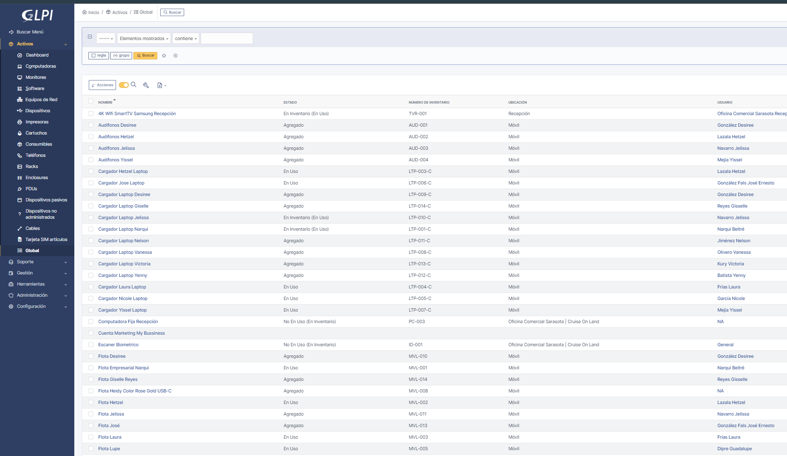

# Gestión del Inventario de TI

La administración efectiva de los activos de tecnología de la información (IT) es fundamental para maximizar el valor y minimizar los riesgos asociados con el hardware y software en cualquier entorno organizacional. Utilizando [**GLPI**](/docs/Herramientas%20Utilizadas/glpi.md).

Este sistema no solo nos permite mantener un registro detallado de cada activo, sino también optimizar su uso, garantizar el cumplimiento de las políticas de IT y apoyar la toma de decisiones estratégicas en cuanto a futuras inversiones y renovaciones tecnológicas.

<!-- :::warning
La representación gráfica anterior ofrece una vista panorámica del proceso de gestión de activos IT, incluidos procesos críticos como la adquisición, asignación, mantenimiento, y eventual retiro de activos. Este diagrama es para fines ilustrativos y puede necesitar adaptaciones según las políticas y procesos específicos adoptados por cada organización.
::: -->

## Proceso de Gestión de Activos

La gestión de activos IT implica varios pasos críticos que ayudan a asegurar que cada activo aporte el máximo valor posible durante su ciclo de vida.

### 1. **Adquisición y Registro**:

La incorporación de nuevos activos de IT comienza con su adquisición y registro en GLPI. Este paso inicial es crucial para establecer la base de datos de activos, incluyendo información esencial como tipo de activo, especificaciones técnicas, fecha de compra, período de garantía, proveedor, y coste. Esta información respalda la gestión efectiva de la garantía, el soporte técnico, y la planificación financiera.

:::tip
Para una gestión efectiva, es práctica común asignar a cada activo un código de inventario único y marcarlo con una etiqueta física. Esto facilita la identificación, seguimiento, y auditoría física de los activos a lo largo de su vida útil.
:::

:::info
 Existe un Inventario General actualmente en la copia de respaldo aquí, de las siguientes oficinas:
    - **Comercial**: *Sarasota Center, Piso 401*
    - **Administrativa**: *Plaza Sahira 104, (Billsun, BHA, Wojo Investments)*
:::

### 2. **Asignación y Uso de Activos**:

Tras su registro, los activos se asignan a los usuarios o departamentos correspondientes. GLPI facilita este proceso permitiendo documentar a qué empleado o ubicación física se asigna cada activo. También es posible llevar un registro del historial de asignaciones, lo que es útil para resolver disputas o para realizar seguimientos de auditoría.

### 3. **Mantenimiento y Actualizaciones**:

El mantenimiento regular y las actualizaciones son esenciales para extender la vida útil de los activos IT y asegurar que funcionen eficientemente. GLPI puede programar y rastrear el mantenimiento preventivo, así como gestionar las actualizaciones de software y hardware. Esto incluye la documentación de servicios realizados, actualizaciones de componentes y cambios de configuración.

:::info

**Las Revisiones de Inventario**: Son *Tickets Recurrentes* que se utilizarán para validar el estado y las existencias del inventario en GLPI, y así mantenerlo actualizado.

Meses de Revisión de Inventario y Actualización de GLPI

- Junio
- Octubre
- Febrero

:::
 

# Otros Procesos Relacionados:

### A. **Soporte y Solución de Problemas**:

A lo largo de su ciclo de vida, los activos pueden experimentar problemas o requerir soporte técnico. GLPI sirve como una plataforma centralizada para gestionar estas incidencias, vinculándolas directamente con los activos afectados. Esto no solo permite un diagnóstico y resolución más rápidos sino que también proporciona datos valiosos sobre el rendimiento y la fiabilidad de los activos a lo largo del tiempo.

Estos incidentes deberán gestionarse según lo descrito en la [**Documentación de Soporte Técnico**](../Procesos/soporte.md)

### B. **Retiro y Disposición Final**:

Cuando un activo llega al final de su vida útil, es crucial retirarlo y disponer de él de manera segura y responsable. GLPI ayuda a documentar y gestionar este proceso, asegurando que se retiren del inventario los activos obsoletos y se cumpla con las políticas de disposición y reciclaje, protegiendo así la información sensible y minimizando el impacto ambiental.

### C. **Cambios de Asignación de Activos**

Cualquier cambio en el *estado*, *descripción*, o *asignación* de un activo 

Por Ejemplo:

- El traspaso de una licencia de Office de una persona a otra.
- Cambio de un monitor de usuario 

Debe ser comunicado al departamento, para actualizarse en GLPI de manera oportuna, toda comunicación de este tipo deberá ser paralela con los departamentos:

1. **Vinculaciones & Legal**
1. **Dirección Administrativa**
1. **Compras y Contrataciones**
