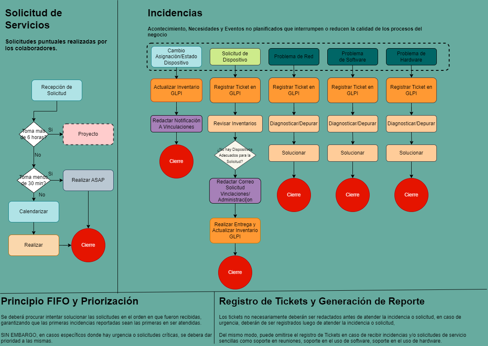
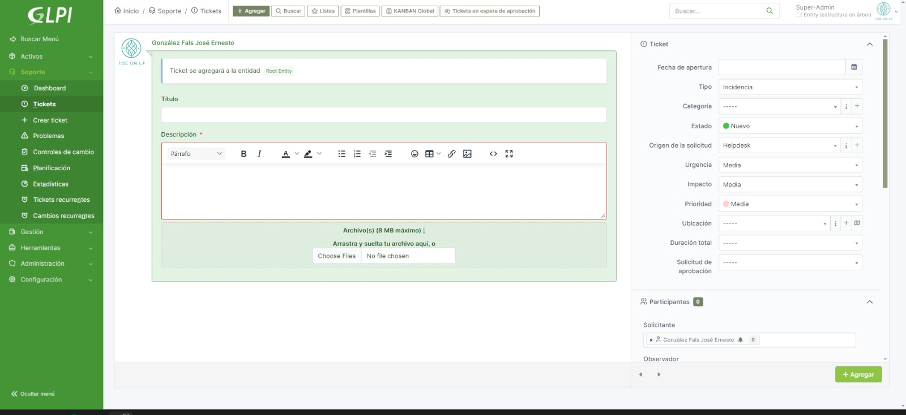
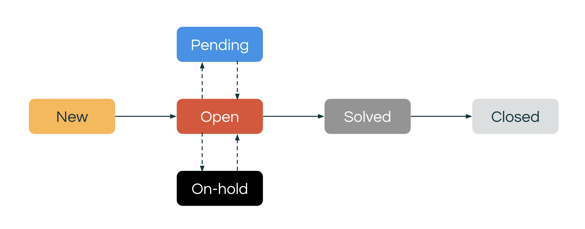

# Tickets y Soporte Técnico

## Uso de la Funcionalidad de Tickets de Servicio

Las incidencias y solicitudes de servicio seran gestionadas mediante los siguientes procesos. Utilizando [**GLPI**](/docs/Herramientas%20Utilizadas/glpi.md)

Este posee un sistema de documentación y gestión del soporte técnico mediante **tickets de servicio**.

:::warning
La ilustración de arriba es solo una referencia para los procesos más comunes de gestión de incidencias y solicitudes a la hora de realizar labores de soporte. 

**No** supone un procedimiento o política establecido, es de carácter ilustrativo 

Gracia :D

:::

## Proceso de Gestión de Servicios e Incidencias

### 1. **Recepción de Necesidades**: 

La gestión de soporte técnico es de caracter reactiva, y con una carga muy variable de trabajo que en algunas ocasiones puede ser muy demandante y en otras mínima, por lo que es importante tener procesos determinados a agotar para regular la carga de trabajo.

:::tip

Para asegurar el tiempo de respuesta mínimo para cada una de las solicitudes e incidencias, adoptamos el principio **FIFO** *(First In, First Out)*. Donde las solicitudes son gestionadas en el orden en que llegan al Departamento.

:::

Al suceder una solicitud de soporte dentro de las descritas en la ilustración superior, se deber en primera instancia **clasificar** la situación. Existen 2 categorías principales: *Incidencias* y *Solicitudes*

1. **Incidencias**: Se definen como *Necesidades, Acontecimientos y Eventos no planificados que interrumpen o reducen la eficiencia de los procesos*
1. **Solicitudes**: *Peticiones o requerimientos hechos por usuarios o clientes para obtener asistencia, información, o servicios específicos relacionados con sistemas de información, hardware, software, o infraestructura de TI.*

:::warning
Como regla general las incidencias tienen una prioridad mayor que las solicitudes. De la misma manera, los tickets con mayor tiempo son prioritarios.

Sin embargo, es importante saber cuando priorizar necesidades de la alta gerencia, clientes o usuarios internos, dependiendo de la urgencia y la importancia de una necesidad determinada.

Es bueno tener ojo con esto.

:::

### 2. **Creación y Gestión de Tickets**: 

Esta es la interfaz de creación de Tickets en GLPI, posee diversos campos que definen características y atributos para los tickets a registrar.

Los pasos para crear un Ticket según lo conversado anteriormente son:

1. Navegar al menú `Tickets` y seleccionar `+ Añadir un ticket`.
2. **Tipo de Ticket**: Elegir entre `Incidencia` o `Solicitud` según el caso a registrar.
3. **Título y Descripción**: Completar con detalles precisos del trabajo a realizar o el incidente a gestionar.
4. **Categoría**: Seleccionar la categoría que mejor represente la naturaleza del trabajo.
5. **Urgencia/Impacto/Prioridad**: Asignar estos valores según la importancia y el efecto esperado del ticket.

El ciclo de vida de un ticket puede pasar por seis diferentes etapas. El estado puede ser establecido y actualizado manualmente por un agente o automáticamente, basado en reglas de negocio.

### 2.1 Estados del Ticket

Los seis estados de un ticket se definen como:

- **Nuevo**: Un agente aún no ha tomado el ticket. Una vez que el agente actualiza el ticket de Nuevo a Abierto, no puede ser movido de vuelta a Nuevo.
- **Abierto**: El ticket está asignado a un agente que está trabajando para resolverlo.
- **Pendiente**: El agente necesita información adicional del solicitante o cliente para continuar resolviendo el ticket.
- **En Espera**: El agente está esperando información adicional o una resolución de un tercero. Este es un estado opcional que tu administrador habilita.
- **Resuelto**: El problema está resuelto. Un ticket resuelto se reabre (si es necesario) cuando el solicitante responde.
- **Cerrado**: El ticket es cerrado por el sistema y no puede ser reabierto. Un ticket cerrado solo se puede ver y no se puede editar de ninguna manera. Como regla general, los tickets se cierran después de cuatro días de estar en el estado resuelto sin respuesta. Tu administrador puede ajustar este marco de tiempo.

### 2.2 Ejemplo

Veamos un ejemplo de cómo un ticket cambia de estado con el tiempo. Tu cliente escribe un correo electrónico solicitando ayuda con alertas de su correo.

:::warning

Lo primero a realizar es consultar la necesidad del usuario interno o cliente, en caso de ser responsabilidad de otro departamento, se refiere y delega el correo.

:::danger
Si la solicitud o incidencia debe ser atendida por el departamento de TI:

1. **Se estima que requiere menos de 15 minutos para ser atendida**
1. **Es de alta urgencia/importancia** (Solicitudes de la Gerencia, o que involucren Alto Riesgo o Impacto)*

Se deberá de procesar la solicitud *al momento*

Y *(En caso de ser relevante)* luego documentar el ticket.
:::
:::note

**En caso contrario** *(Ni urgente, ni toma menos de 15 min)* se crea un nuevo ticket con la información proporcionada y luego, se atiende.

*Una vez creado el ticket (si aplica)*:
 Procedes a asignarte el ticket y comunicar al cliente o usuario interno que ya estás trabajando en su solicitud. Si es necesario obtener más detalles o requieres que el cliente realice alguna acción específica para proceder, es crucial mantener una comunicación clara y precisa.

Por ejemplo, si falta información crítica para proceder, podrías responder con un mensaje como: 

*'Para poder asistirte mejor, ¿podrías intentar hacer X, Y y Z, y luego proporcionarnos los resultados? Esto nos ayudará a entender mejor la situación y a ofrecerte una solución adecuada.' Tras enviar esta solicitud, marcas el ticket como Pendiente, esperando la respuesta del cliente.*

Supongamos que el cliente responde satisfactoriamente, pero menciona no poder completar un paso final. Este es el momento en que reabres el ticket, que ahora vuelve a estar en estado Abierto en tu panel de control, indicando que requiere tu atención directa nuevamente.

Finalmente, una vez que confirmas que la solución ha sido efectiva o que la solicitud ha sido atendida satisfactoriamente, procedes a marcar el ticket como Resuelto, indicando que se ha dado una solución al problema o necesidad inicial.

:::

:::info

Puedes conocer más acerca de la gestión del ciclo de vida de los tickets [**aquí**](https://glpi-user-documentation.readthedocs.io/fr/latest/modules/assistance/tickets.html)
:::
